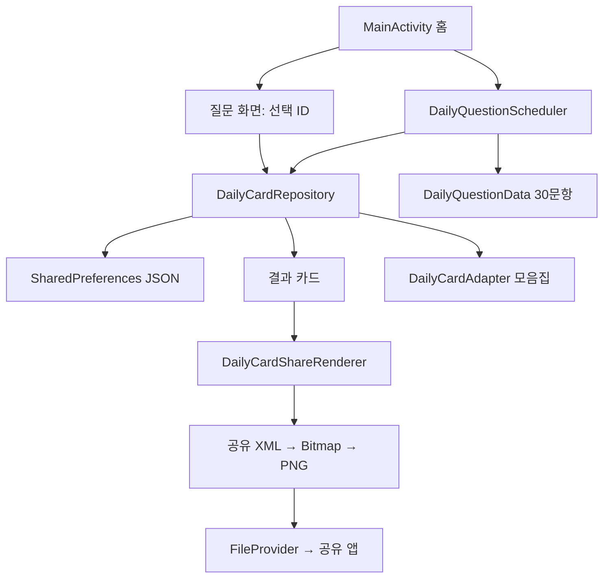

# 구조와 데이터 흐름



## 데이터 세 종류

| 모델 | 역할 |
|---|---|
| DailyOption | 답변·결과 제목·해석·대화 문구 |
| DailyQuestion | 질문 ID·주제·그림 키·본문·선택지 목록 |
| DailyCardRecord | 날짜·선택 ID·질문 스냅샷·즐겨찾기·시각 |

## 오늘의 질문

```kotlin
val days = ChronoUnit.DAYS.between(anchorDate, targetDate)
val index = Math.floorMod(days, 30L).toInt()
val questionId = fixedOrder[index]
```

기준일부터 지난 날짜를 계산하고 30개 순서 중 위치를 구합니다. 첫날 Q01, 다음 날 Q06입니다. 저장한 날짜는 기존 스냅샷을 우선합니다. 방문하지 않은 날도 날짜는 흐르며, 30일 뒤 반복됩니다.

## 저장과 스냅샷

`upsertAnswer`는 날짜가 있으면 copy로 답변을 바꾸고 없으면 새 기록을 추가합니다. 원래 생성 시각과 즐겨찾기는 수정 시 유지됩니다. 객체를 JSON 문자열로 바꿔 저장하며 쓰기는 단일 executor에서 실행합니다. 읽기는 호출 스레드에서 수행됩니다.

## 화면과 리소스

하나의 MainActivity가 아홉 화면 상태를 관리합니다. 화면은 모두 숨긴 뒤 필요한 레이아웃 하나를 보여줍니다. item_daily_option은 네 선택지에 재사용하고 item_daily_card는 홈 미리보기와 모음집에 재사용합니다. 여섯 주제 그림은 VectorDrawable입니다.

## 원본 소스로 바로 이동

- [MainActivity](../source/app/src/main/java/com/testapp/fifteenthapp_pshocology/MainActivity.kt)
- [모델](../source/app/src/main/java/com/testapp/fifteenthapp_pshocology/DailyCardModels.kt)
- [날짜 스케줄러](../source/app/src/main/java/com/testapp/fifteenthapp_pshocology/DailyQuestionScheduler.kt)
- [저장소](../source/app/src/main/java/com/testapp/fifteenthapp_pshocology/DailyCardRepository.kt)
- [목록 어댑터](../source/app/src/main/java/com/testapp/fifteenthapp_pshocology/DailyCardAdapter.kt)
- [공유 렌더러](../source/app/src/main/java/com/testapp/fifteenthapp_pshocology/DailyCardShareRenderer.kt)
- [화면 XML](../source/app/src/main/res/layout/activity_main.xml)
